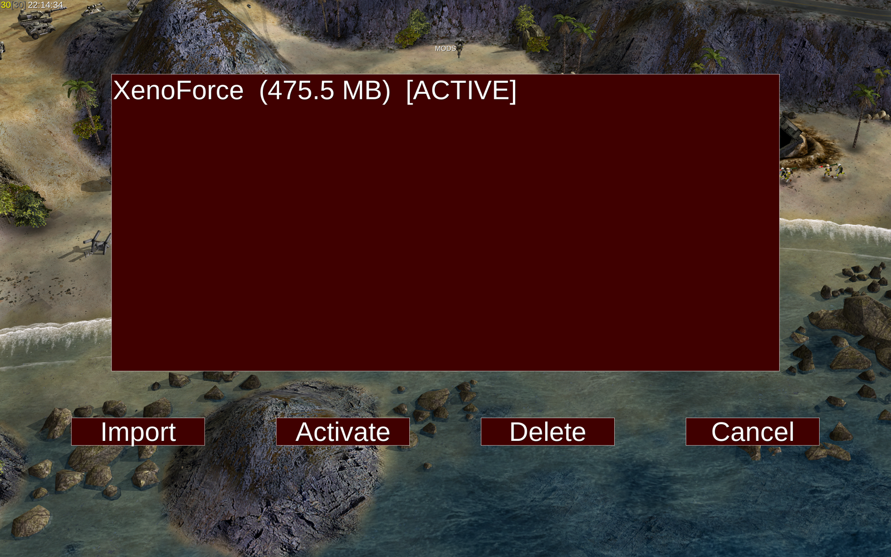
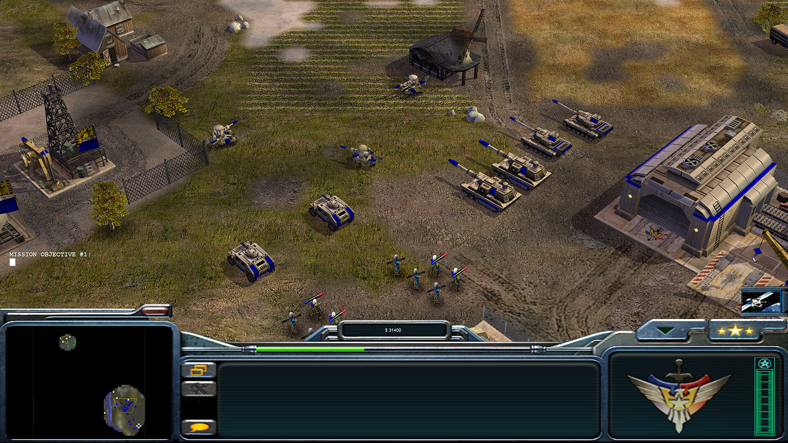

# Command & Conquer: Generals Zero Hour — Android


**The complete 2003 RTS, running natively on Android — with features the stock port never had.**

This is **not an emulator** and **not a compatibility layer**. It's the real C++ engine compiled for
arm64, rendering DirectX 8 → [DXVK](https://github.com/doitsujin/dxvk) → Vulkan on Adreno/Mali GPUs,
with a modern touch UI, in-app mod management, and a bundled Mesa Turnip driver that fixes the
stability problems of the stock Android Vulkan stack.

> ⚠️ **You must own a legal copy of the game.** No game assets are included or distributed.
> See [How to Play](#how-to-play).

---

## ✨ What's New in This Fork

These features are **not available in the original GeneralsZH-Android port** — they were built on
top of it and are unique to this build.

### 🚀 Bundled Mesa Turnip Vulkan driver — no more crashes

The stock Qualcomm Adreno driver has a memory-allocator bug that crashes DXVK — reliably when a
mod is loaded, and at ~150s even in vanilla play. This fork bundles **Mesa Turnip** (the open
Mesa driver for Adreno) inside the APK and loads it per-app via `libadrenotools`:

- **No root, no Magisk, no system changes** — other apps keep the stock driver
- Verified: the game runs **6+ minutes with a large mod active, zero crash signatures**
- DXVK reports `turnip Mesa driver 26.1.99` instead of the buggy Qualcomm blob
- The driver is a **drop-in `.so`** — swap `assets/turnip/libvulkan_freedreno.so` to upgrade

### 🎮 In-app Mods picker — activate mods without touching the filesystem

The main-menu **Mods** button (green when a mod is active) opens a full in-game mod manager:

<p align="center">
  
</p>

- **Activate** a mod from `GameData/Mods/` — takes effect on the next launch
- **Import** a mod folder through the Android Storage Access Framework (no ADB required)
- **Delete** mods in-place (the active mod is protected)
- Shows each mod's size and active state

### 📁 Loose mod files that actually work

The original port could only load mods from `.big` archives. This fork fixes the engine's file
lookup so **loose mod folders** work too — the way most mods (like XenoForce) are actually
distributed:

- `Data/INI/Object/*.ini`, `Data/INI/ParticleSystem/*.ini`, `Data/INI/FXList/*.ini` and other
  subdirectory INI files are now discovered from a selected mod's loose files
- Verified with XenoForce: **+49 particle systems and +323 object templates** register from
  loose files alone (the mod's VFX and units load)
- Regression-tested — the fallback probe is covered by an automated test

### 🔍 Readable UI on high-DPI tablets

The 2003-era interface was designed for 800×600. On a 3040×1904 tablet every pixel was
microscopic — health bars were a 3px sliver, effectively invisible. This fork scales the
in-world icon UI (health bars, veterancy, ammo, captions) by the display height, so:

- **Health bars are actually visible** above units and buildings
- Icons and captions read clearly at native resolution

### ⚡ 60 FPS toggle

A dedicated **60 FPS** button on the main menu (persisted to `Options.ini`) raises the render
rate to 60 while a frame-pacer keeps the simulation at its deterministic 30 Hz — **no game-speed
change, no replay desync**. Vanilla behavior is untouched when off.

### 🔊 FFmpeg audio backend

Real audio decoding via a minimal static FFmpeg build (SFX, speech, music) — replacing the
silent stub of the original port. Codec scope (`pcm_s16le`, `adpcm_ima_wav`, `mp3`) is derived
from the actual retail `.big` assets.

---

## Status

| Feature | Status |
|---------|--------|
| Full engine init (all subsystem stores) | ✅ |
| DXVK D3D8→Vulkan rendering | ✅ |
| Main menu renders with text | ✅ |
| Touch input (tap, drag, pinch) | ✅ |
| Mod loading (`mod.txt` / Intent extra) | ✅ verified on-device |
| **In-app Mods picker + SAF import** | ✅ |
| **Loose mod files (subdirectory INIs)** | ✅ verified (+49 particle, +323 object with XenoForce) |
| **Bundled Turnip driver (crash fix)** | ✅ verified — 6+ min with mod, 0 crashes |
| **High-DPI UI scaling** | ✅ (health bars / icons readable) |
| **60 FPS toggle** | ✅ |
| **FFmpeg audio** | ⚠️ backend fixed (opensl), decoder built — on-device audibility in progress |
| Full gameplay session (skirmish) | ⚠️ boots & playable |

**Tested on:** Lenovo TB322FC (Android 16, Adreno 830, 1904×3040) • OnePlus Pad 2 (Snapdragon 8 Gen 3, Adreno 830, 3392×2400)



---

## How to Play

### What you need

1. **An Android tablet** with:
   - **arm64-v8a** architecture (all modern tablets)
   - **Android 7.0+** (API 24+, for system Vulkan support)
   - A **Vulkan-capable GPU** (Adreno 7xx+, Mali-G77+, or equivalent)
   - **~3GB free RAM** for the game process *(estimate — the DXVK→Vulkan layer adds overhead over the 2003 game's 128MB target)*
   - **~2.5GB storage** for game data
2. **A legal copy of C&C Generals Zero Hour** — [Steam](https://store.steampowered.com/app/2732960/), EA App, or a retail install (Complete Edition or both Generals + Zero Hour)

### Step 1: Download & install the APK

```bash
# From the Releases page, or:
adb install GeneralsZH-full.apk
```

### Step 2: Copy your game data

The game needs its `.big` archive files on the tablet's filesystem (the app does not bundle
game assets). Copy all the `.big` files from your install's `Data/` folder:

| File | Contents |
|------|----------|
| `INI.big` / `INIZH.big` | Game INI data |
| `Textures.big` / `TexturesZH.big` | Game textures |
| `Audio.big` / `AudioZH.big` | Sound effects |
| `Music.big` / `MusicZH.big` | Music tracks |
| `MapsZH.big` | Map data |
| `Terrain.big` / `TerrainZH.big` | Terrain data |
| `W3D.big` / `W3DZH.big` | 3D models |
| `English.big` / `EnglishZH.big` | Text/speech |
| `Speech*.big` | Voice-over |
| `Window.big` / `WindowZH.big` | UI textures |
| `ShadersZH.big` | Shaders |

### Step 3: Play

Launch **"Generals ZH"**. The main menu appears within seconds.

### Installing a mod (this fork's way)

1. Put the mod folder under `GameData/Mods/` (or use the **Mods → Import** SAF picker)
2. Tap **Mods** on the main menu → select the mod → **Activate**
3. Relaunch — the Mods button turns green to confirm the mod is active

---

## Touch Controls

| Gesture | Action |
|---------|--------|
| **Tap** | Left-click (select unit, click button) |
| **Tap and hold (600ms)** | Right-click (context menu, deselect) |
| **Drag** | Left-click drag (selection box) |
| **Two-finger drag** | Right-click drag (camera pan) |
| **Two-finger pinch** | Mouse wheel (zoom in/out) |

---

## Build from Source

### Prerequisites

- **Android NDK r27** (27.1.12297006), **Android SDK** with build-tools 35.0.0
- **CMake 3.25+**, **Ninja**, **Meson** (for DXVK cross-compilation)
- **Android Studio** or Gradle 8.7+ (for APK packaging)

### Build steps

```bash
# Clone (includes the DXVK submodule)
git clone https://github.com/ashrid/GeneralsZH-Android.git
cd GeneralsZH-Android
git submodule update --init --recursive

# Configure + build the native engine (arm64-v8a)
cmake --preset android-vulkan
cmake --build build/android-vulkan --target z_generals

# Package the APK (stages fonts, DXVK, Turnip driver, SDL3, etc.)
./scripts/build/android/package-android-zh.sh

# The signed APK appears at:
#   android/app/build/outputs/apk/release/app-release.apk
```

The build is **fully self-contained** — the Mesa Turnip driver, DXVK patches, and all runtime
libraries are included in the repo. No build-time downloads.

---

## Mods

The engine supports mods via the `-mod <path>` command-line argument, wired on Android through
two mechanisms:

1. **Mods picker** (persistent): the in-game **Mods** button → **Activate** writes `mod.txt`;
   the engine injects `-mod <path>` on the next launch. **SAF folder import** brings a mod in
   without ADB.
2. **Intent extra** (per-launch override):
   `adb shell am start -n me.generalsx.zh/.GameActivity --es "mod" "/sdcard/Android/data/me.generalsx.zh/files/GameData/Mods/YourMod"`

Only one mod is active at a time. The **Mods button is green** when a mod is active, **red** when
running vanilla.

### Mod file priority

| Priority | Source | Behavior |
| --- | --- | --- |
| 1 | Loose file in `GameData/` | Local file system wins over archives |
| 2 | Loose file in the selected mod dir | Checked after GameData root, before archives |
| 3 | Selected mod archive | Overrides retail archives |
| 4 | Retail archives | Base Generals + Zero Hour `.big` files |

This fork specifically fixes priority 2: **loose subdirectory INI files** in the selected mod
dir are now discovered (the original port silently ignored them, which broke mod VFX and units).

---

## Architecture

```
┌──────────────────────────────────────────────┐
│              Game Engine (C++)                │
│         (~500k LOC, GPL v3 source)            │
├──────────────────────────────────────────────┤
│  Graphics: DirectX 8 API calls                │
│     ↓                                         │
│  DXVK (libdxvk_d3d8.so) — D3D8 → Vulkan      │
│     ↓                                         │
│  Mesa Turnip (bundled, per-app) or stock HAL  │
│     ↓                                         │
│  Android Vulkan Driver (Adreno / Mali)        │
├──────────────────────────────────────────────┤
│  Windowing: SDL3 (touch → synthetic mouse)    │
│  Audio: OpenAL Soft (opensl) + FFmpeg decoder │
│  Mods: in-app picker + SAF import + loose VFS │
└──────────────────────────────────────────────┘
```

The engine speaks DirectX 8. DXVK translates to Vulkan. This fork adds **libadrenotools**,
which loads a bundled Mesa Turnip driver per-app — so the game gets a stable, open driver while
the rest of the system keeps the vendor HAL.

---

## Lineage & Credits

- **Westwood / EA Pacific** — the original game
- **EA** — the GPL v3 source release
- **[TheSuperHackers](https://github.com/TheSuperHackers/GeneralsGameCode)** — community mainline
- **[Fighter19](https://github.com/Fighter19/CnC_Generals_Zero_Hour)** — original Unix/64-bit port (SDL3, DXVK)
- **[fbraz3/GeneralsX](https://github.com/fbraz3/GeneralsX)** — macOS/Linux port
- **[ammaarreshi/Generals-Mac-iOS-iPad](https://github.com/ammaarreshi/Generals-Mac-iOS-iPad)** — iOS/iPadOS port
- **This fork** — Android port + Turnip driver bundling, mod picker, loose-mod VFS fix, UI scaling, 60 FPS, FFmpeg audio
- **[bylaws/libadrenotools](https://github.com/bylaws/libadrenotools)** — rootless per-app Vulkan driver loading
- **Mesa Turnip** — the open Adreno Vulkan driver
- **DXVK, SDL3, OpenAL Soft, Liberation Fonts** — the open-source load-bearing walls

---

## Legal

This project does not include or distribute any game assets, data files, or copyrighted game
content. It is an engine port that requires the user to provide their own legally-obtained copy
of Command & Conquer Generals Zero Hour. Game assets are not included and not distributed.

Command & Conquer is a trademark of Electronic Arts Inc. This project is not affiliated with or
endorsed by Electronic Arts.
